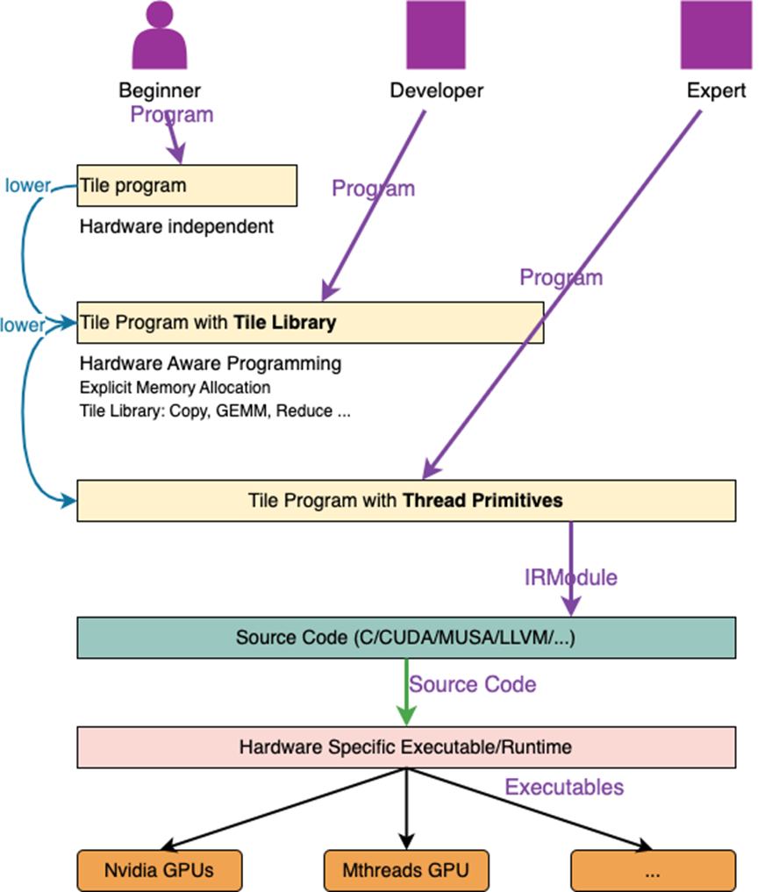
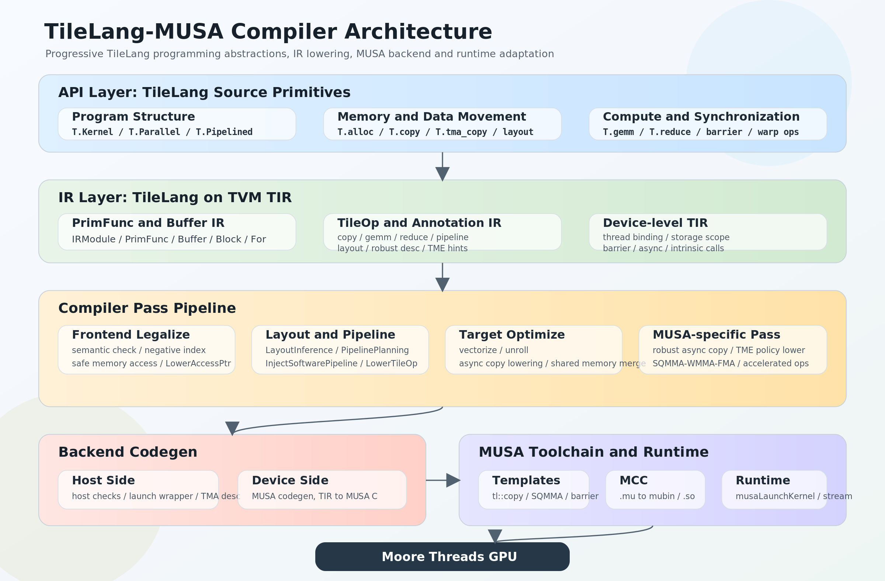

## 概述

### TileLang-MUSA 是什么

[TileLang](https://tilelang.com/) 是一种嵌入 Python 的 tile-based DSL，
用于编写高性能 GPU/CPU kernel。它基于 TVM/TIR 构建编译器，开发者可以用
Python 风格的代码表达 tile、循环、内存搬运和算子计算，再由编译器根据
目标设备生成对应的设备代码。

TileLang-MUSA 是 TileLang 面向 MUSA 的后端和发行适配，保留 TileLang 的
通用 kernel 编程模型，并为 MUSA 增加 TME、async copy、SQMMA、WMMA、MMA、
barrier、warp-specialize、robust copy 和 MUSA layout 等能力。它适合：

- 在 MUSA 上快速验证 elementwise、reduce、GEMM、GEMV、attention 和卷积
  kernel 的算法表达；
- 将 global/shared/fragment/local 之间的数据搬运和计算组织成可调度的 tile
  pipeline；
- 在需要时控制 warp 划分、shared layout、异步 barrier、低精度 operand 和
  指令选择；
- 对照生成的 TIR、MUSA C 源码和 profiler 结果，逐步定位正确性和性能问题。

:::tip 官方 TileLang 文档
通用 API、最新跨后端编程指南和完整 API Reference 以 TileLang 官方文档为准：

- [TileLang 官方文档](https://tilelang.com/)
- [编程指南总览](https://tilelang.com/programming_guides/overview.html)
- [Language Basics](https://tilelang.com/programming_guides/language_basics.html)
- [Instructions Reference](https://tilelang.com/programming_guides/instructions.html)
- [API Reference](https://tilelang.com/autoapi/tilelang/index.html)

本目录补充 MUSA SDK 版本、MUSA 后端扩展和设备相关限制。
:::



### 解决的问题

| 开发阶段 | TileLang-MUSA 提供的接口 | 适合解决的问题 |
| --- | --- | --- |
| 算法表达 | `T.Tensor`、`T.Kernel`、`T.Parallel`、`T.serial` | 用 tile 级代码表达 elementwise、reduce 和自定义算子 |
| 数据搬运 | `T.copy`、`T.async_copy`、`T.Pipelined` | 组织 global→shared、shared→fragment 和计算重叠 |
| 矩阵计算 | `T.gemm`、`T.gemm_sp`、fragment | 构建 GEMM、稀疏 GEMM、attention 和量化计算 |
| MUSA 调优 | `T.tma_copy`、robust descriptor、layout annotation、barrier | 使用 TME、SQMMA/WMMA 和显式同步优化关键路径 |
| 结果验证 | `get_kernel_source()`、TIR dump、profiler、`T.device_assert` | 检查 lowering、边界条件、延迟和生成代码 |
| 参数搜索 | `tilelang.autotune`、layout profiler | 搜索 tile size、线程数、pipeline stage 和 warp 划分 |

### 分层编程模型

TileLang-MUSA 的接口可以按控制程度分为三层：

1. **基础层**：使用 `T.Tensor`、`T.Kernel`、`T.Parallel`、`T.copy` 和
   `T.gemm` 表达算法，先验证输出和边界条件；
2. **调度层**：使用 `T.Pipelined`、`T.unroll`、`T.alloc_shared`、fragment、
   autotune 和 target 配置控制数据复用、并行度和 pipeline；
3. **硬件层**：使用 `T.tma_copy`、robust copy、`T.annotate_layout`、SQMMA
   layout、显式 mbarrier、warp vote 和 MUSA accelerated ops 做设备级调优。

低层接口不会自动修复算法上的数据依赖。每次引入异步搬运、layout annotation
或手动 barrier 后，都应重新运行正确性测试，并检查生成的 MUSA C 代码。

### 编译和运行流程

TileLang-MUSA 的典型编译链如下：

```text
Python kernel
    ↓  @tilelang.jit / tilelang.compile
TileLang DSL / TIR
    ↓  target="musa"
MUSA backend lowering
    ↓  TileOp、layout、pipeline、barrier、runtime
MUSA C/C++ source and device code
    ↓  MUSA toolchain / wrapper
JIT compiled kernel
    ↓
MUSA tensor inputs and outputs
```

编译阶段会根据 target、operand scope、shape、dtype、线程布局和 pass config
选择 lowering 路径。运行阶段通过 `torch_musa` tensor 传入设备内存；首次
编译的时间应与后续 kernel latency 分开统计。

### MUSA 后端的主要映射

| TileLang 接口 | MUSA 后端可能选择的路径 | 主要约束 |
| --- | --- | --- |
| `T.copy` | 同步 SIMT、TME、LDLMS 或 async copy lowering | source/destination scope、连续性、dtype 和边界必须满足路径条件 |
| `T.tma_copy` | 带 descriptor 的 TME load/store | load barrier 的 arrive/wait 由 pipeline 或用户负责 |
| `T.gemm` | MP31/PH1 的 SQMMA、WMMA、FMA；MP22/QY2 的 MMA、WMMA、FMA | operand scope、shape、dtype、transpose 和 warp policy 共同决定 |
| `T.gemm_sp` | QY2 sparse MMA 或 MP31 sparse FMA | 2:4 compressed operand、metadata 和 K tile 必须匹配 |
| `T.c2d_im2col_*` | TME im2col fast path 或带边界补零的 scalar fallback | 通道搬运宽度、descriptor 和 destination layout 必须可证明合法 |
| `T.Pipelined` | producer/consumer stage、buffer versioning 和同步 pass | 异步 copy 的 wait 不能晚于第一次消费目标 buffer |

MUSA 特有参数和限制请参阅 [MUSA 扩展](./05_musa_extensions.md)；通用
DSL 语义请参阅 [官方编程接口](./04_official_programming_interface.md)。



### 支持的算子和使用场景

仓库文档和测试覆盖的常见场景包括：

- **Elementwise 和 reduction**：向量加法、逐元素转换、sum/max/min、scan；
- **矩阵乘法**：dense GEMM、低精度 GEMM、GEMV、2:4 sparse GEMM；
- **Transformer/LLM**：FlashAttention、Linear Attention、MLA、GDN 和 MoE 相关
  kernel；
- **卷积数据变换**：NWC、NHWC、NDHWC 输入的 1D/2D/3D im2col；
- **设备级优化**：TME descriptor、robust copy、cache policy、SQMMA layout、
  vector atomic 和 IEEE math。

这些能力并不表示任意 shape、dtype 或设备都能使用同一条硬件路径。编写公共
kernel 时应保留 fallback 或 guard，并在目标设备上验证实际 lowering。

### 推荐工作流

1. **准备环境**：安装 MUSA SDK、`torch_musa`、MUSA SDK 配套发行版和匹配的
   `apache-tvm-ffi`，运行[安装前检查](./01_version_environment.md)；
2. **从最小 kernel 开始**：使用[快速开始](./03_quick_start.md)中的 vector
   add，先验证编译、运行和 `torch.testing.assert_close`；
3. **组织 tile**：使用 shared/fragment 分配、`T.copy`、`T.gemm` 和
   `T.Pipelined` 构建 GEMM 或其他算子；
4. **处理边界**：测试完整 tile、tail tile、转置/非连续 view、不同 dtype 和
   越界访问；
5. **确认 lowering**：打印 `kernel.get_kernel_source()`，必要时查看 TIR、
   pass config 和临时编译产物；
6. **再做调优**：逐项引入 TME、layout、warp policy、cache hint、显式 barrier
   和 autotune，并在每一步重新校验结果；
7. **记录结果**：固定设备、输入、warmup/repeat 和 target，使用 profiler
   记录 latency、带宽或吞吐，避免把首次编译时间计入 kernel 性能。

### 版本渠道摘要

当前文档使用的是 **MUSA SDK 配套正式版** `v0.1.12+musa.2`，相对开源
`v0.1.12+musa.1` 包含额外 bugfix；历史 MUSA SDK 配套正式版为
`v0.1.8+musa.3`。开源仓库还提供 `v0.1.13+musa.1`，适合阅读源码、测试
和 release 说明，但不能直接替代当前 MUSA SDK 配套包。

- [版本与环境](./01_version_environment.md)：SDK、Python、target、版本渠道和兼容规则；
- [安装](./02_installation.md)：MUSA SDK 配套发行版、历史包和源码参考；
- [GitHub 开源仓库](https://github.com/tile-ai/tilelang-musa)：源码、issue、提交记录和 release。

## 文档目录

- [版本与环境](./01_version_environment.md)
- [安装](./02_installation.md)
- [快速开始](./03_quick_start.md)
- [官方编程接口](./04_official_programming_interface.md)
- [MUSA 扩展](./05_musa_extensions.md)
- [典型用例](./06_typical_use_cases.md)
- [调试诊断](./07_debug_diagnostics.md)
- [性能分析](./08_performance.md)
